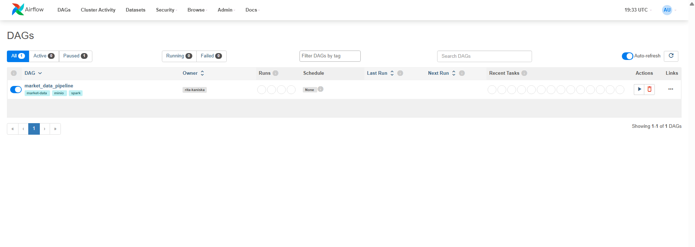
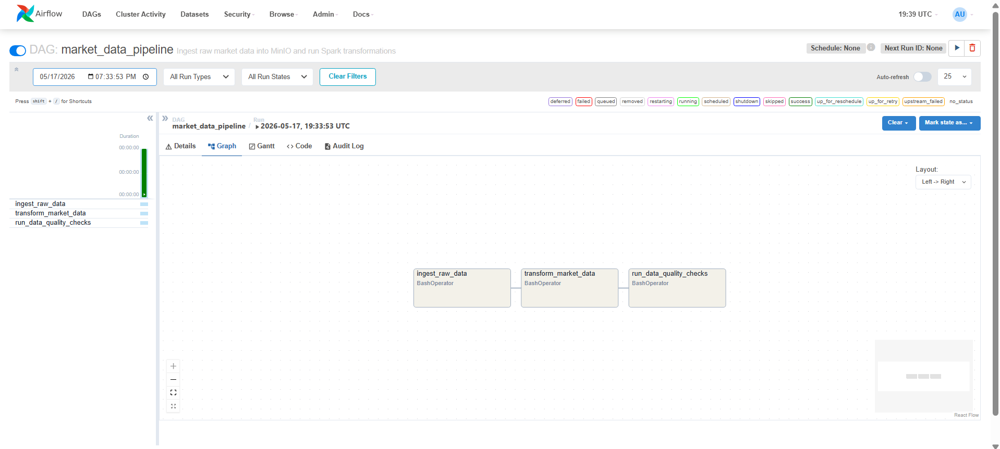

# financial-market-lakehouse

An engineering-grade, idempotent financial data lakehouse pipeline built with PySpark, Airflow, and MinIO for high-throughput market data analytics.

## Quick Start (5 Steps)

1. Copy environment template and place market CSV files under `data/`:
   ```bash
   cp .env.example .env
   ```
2. Start the local platform:
   ```bash
   docker compose up -d
   ```
3. Open Airflow at [http://localhost:8080](http://localhost:8080) and trigger the `market_data_pipeline` DAG.
4. Wait until all three tasks succeed: `ingest_raw_data` → `transform_market_data` → `run_data_quality_checks`.
5. Open the serving layer at [http://localhost:8501](http://localhost:8501) (Streamlit reads curated Parquet via DuckDB and renders price, volume, and VWAP analytics).

## Local UIs

| Service | URL |
|---------|-----|
| Airflow | http://localhost:8080 |
| Spark Master | http://localhost:8081 |
| MinIO API | http://localhost:9000 |
| MinIO Console | http://localhost:9001 |
| Streamlit Dashboard | http://localhost:8501 |

Default Airflow credentials are defined in `.env` (`_AIRFLOW_WWW_USER_USERNAME` / `_AIRFLOW_WWW_USER_PASSWORD`).

## Data Source

The raw market data used in this project was obtained from the following public Kaggle dataset:

- Dataset: BTC Price 1m
- Author: kaanxtr
- Source: https://www.kaggle.com/datasets/kaanxtr/btc-price-1m
- Example file used in this project: `AAVEUSDT`

This dataset contains 1-minute OHLCV-style cryptocurrency market data for multiple trading pairs, organized as one CSV file per symbol.

Note:
- The data is used for educational and take-home assignment purposes only.
- Please refer to the original Kaggle dataset page for licensing, updates, and full metadata.

## Pipeline Flow

`Local CSV -> Airflow ingest -> MinIO raw-zone -> Spark transform (staging) -> Data quality -> MinIO curated-zone -> DuckDB/Streamlit`

Transform jobs write to a **staging** prefix first. Data quality checks run against staging; only successful runs are promoted into the curated zone. Failed checks leave curated data unchanged.

## Environment Variables

See [`.env.example`](.env.example) for the full list. Important values:

- `MINIO_ENDPOINT` — use `http://localhost:9000` on the host, `http://minio:9000` inside Docker services
- `MIN_CURATED_FACT_ROWS` — minimum fact row count required before promotion (lower for tiny dev samples)
- `CURATED_FACT_TRADES_PATH` — DuckDB S3 path pattern for the dashboard

## Python Dependencies

```bash
pip install -r requirements.txt
pytest
```

Run Streamlit on the host (without the Streamlit container):

```bash
streamlit run dashboard/app.py
```

## Data Lake Layout

### Raw Zone

- `raw-zone/market_data/symbol=<SYMBOL>/<FILE>.csv`

Example: `raw-zone/market_data/symbol=BTCUSDT/BTCUSDT.csv`

### Staging Zone

- `curated-zone/staging/fact_trades/date=YYYY-MM-DD/...`
- `curated-zone/staging/dim_symbol/...`
- `curated-zone/staging/dim_time/...`

### Curated Zone

- `curated-zone/fact_trades/date=YYYY-MM-DD/...`
- `curated-zone/dim_symbol/...`
- `curated-zone/dim_time/...`

## Transformation Outputs

The Spark transformation layer:

- parses timestamps and casts numeric columns
- filters duplicate or invalid market rows
- computes `vwap` and `moving_avg_5`
- writes star-schema outputs to staging with `partitionBy("date")` and dynamic partition overwrite

## Airflow Orchestration

The DAG chains: `ingest_raw_data` → `transform_market_data` → `run_data_quality_checks` (retry: 3 attempts, 5 minutes apart).





## Data Quality Checks

At least six checks run on staging data before promotion:

- minimum row count threshold (`MIN_CURATED_FACT_ROWS`)
- non-null `symbol`
- positive `close_price`
- non-null `event_timestamp`
- unique `(symbol, event_timestamp)` pairs
- referential integrity between `fact_trades` and `dim_symbol`
